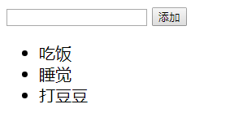

利用 Vue 实现一个简单的 TodoList。一共应用到了以下几个 Vue 的知识点：

- v-for
- v-model
- v-on
- component

<!-- more -->

要实现这样一个效果：在 `<input>` 标签里输入内容，点击 `<button>`，把内容添加到 `<li>` 标签中



# 最简单的写法

HTML 页面需要这几个标签：

- `input`
- `button`
- `ul`
- `ui`

完整代码如下

```html
<!DOCTYPE html>
<html lang="zh-CN">
<head>
    <meta charset="utf-8">
    <meta http-equiv="X-UA-Compatible" content="IE=edge">
    <meta name="viewport" content="width=device-width, initial-scale=1">
    <title>TodoList</title>
</head>
<body>
<div id="app">
	<input type="text" v-model="newTodo"/>
	<button v-on:click="addNewTodo">添加</button>
	<ul>
		<li v-for="todo in todoList">{{ todo }}</li>
	</ul>
</div>

<script src="js/lib/vue.min.js"></script>
<script src="js/todoList.js"></script>
</body>
</html>
```

然后新建一个 Vue 实例，两个变量和一个点击事件监听

```javascript
var vm = new Vue({
	el: '#app',
	data: {
		newTodo: null,
		todoList: []
	},
	methods: {
		addNewTodo: function() {
			this.todoList.push(this.newTodo);
			this.newTodo = null;
		}
	}
});
```

# 组件化

现在把 todo 项封装成一个组件 `todo-item`

## 使用 props 向子组件传递数据

首先在 Vue 实例里局部注册一个组件 `todo-item`，通过 `props` 向子组件传递数据

```javascript
var vm = new Vue({
	// 省略...
	
	components: {
		'todo-item': {
			props: ['content'],
			template: '<li>{{ content }}</li>'
		}
	},
	
	// 省略...
});
```

然后在 HTML 页面中使用 `v-bind` 来传递 `props` 的值

```html
<ul>
	<todo-item v-bind:content="todo" v-for="todo in todoList"></todo-item>
</ul>
```

## 子组件使用 $emit 向父组件发送事件与传值

现在想实现一个功能：点击 todo 项时，就把它删除。那么就需要在点击 `<todo-item>` 组件时通知父组件把 `todoList` 数组的某一项删除

对于这样的需求，可以在子组件中添加一个点击事件，然后**子组件使用 `$emit` 向外发出事件去通知父组件**，然后**父组件再利用 `v-on:` 指令监听这个事件**即可

父组件把 todo 项的 index 也传递到 `<todo-item>` 里

```html
<todo-item v-bind:content="todo"
		   v-bind:index="index"
		   v-for="(todo, index) in todoList">
</todo-item>
```

然后 `<todo-item>` 监听一个点击事件调用 `handleItemClick` 方法，向父组件发送一个 `delete` 事件，同时把 `index` 的值也传递出去

```javascript
var vm = new Vue({
	// 省略...
	
	components: {
		'todo-item': {
			props: ['content', 'index'],
			template: '<li @click="handleItemClick">{{ content }}</li>',
			methods: {
				handleItemClick: function() {
					this.$emit('delete', this.index);
				}
			}
		}
	},
	
	// 省略...
});
```

父组件用 `v-on:` 监听子组件传递出来的 `delete` 事件，调用 `deleteItem` 方法

```html
<todo-item v-bind:content="todo"
		   v-bind:index="index"
		   v-for="(todo, index) in todoList" 
		   v-on:delete='deleteItem'>
</todo-item>
```

在 `deleteItem` 方法里获取到子组件传递的 `index`，然后进行删除操作

```javascript
var vm = new Vue({
	// 省略...
	
	components: {
		'todo-item': {
			props: ['content', 'index'],
			template: '<li @click="handleItemClick">{{ content }}</li>',
			methods: {
				handleItemClick: function() {
					this.$emit('delete', this.index);
				}
			}
		}
	},
	methods: {
		// 省略...
		
		deleteItem: function(index) {
			this.todoList.splice(index, 1);
		}
	}
});
```
